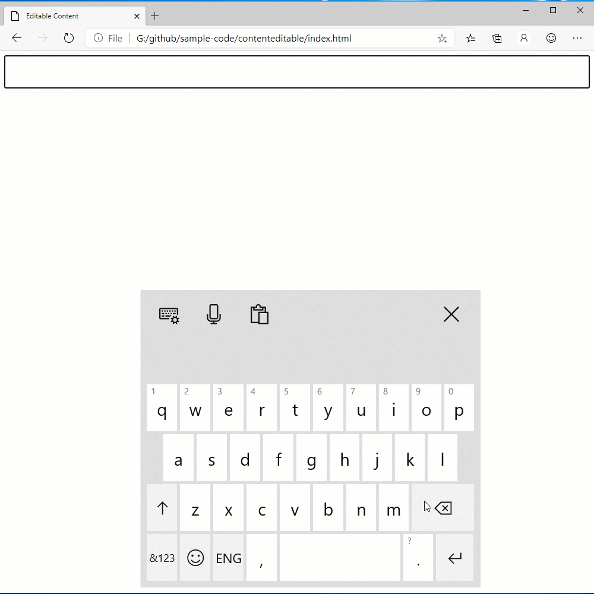
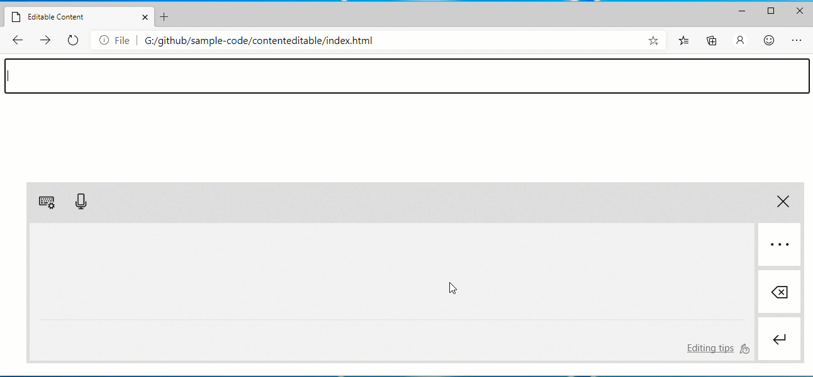
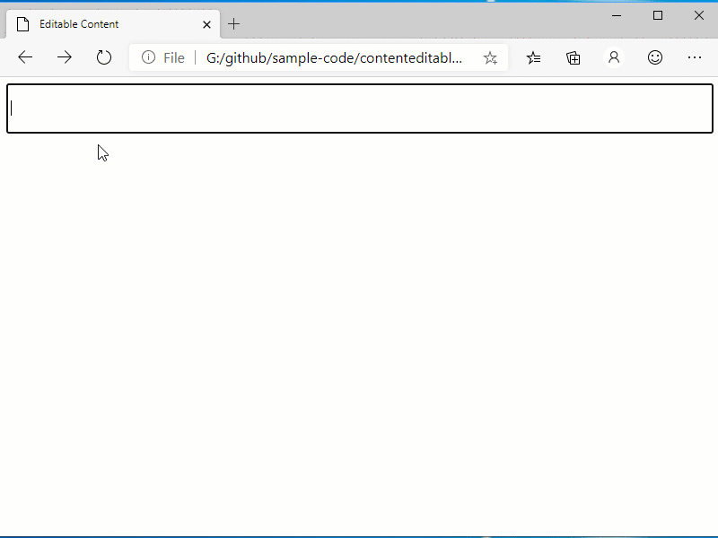
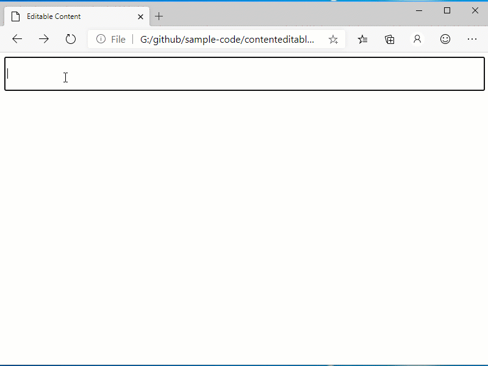

# EditContext API Explainer
## Introduction
The EditContext is a new API that simplifies the process of integrating a web app with [advanced text input methods](#example-text-input-methods), improves accessibility and performance, and unlocks new capabilities for web-based editors.

## Motivation
The web platform provides out-of-the-box editing experiences for single lines of plain-text (input), small amounts of multi-line plain-text (textarea) and a starting point for building an HTML document editing experience (contenteditable elements).

Each of the editable elements provided by the web platform comes with built-in editing behaviors that are often inadequate to power the desired editing experience. As a result, web-based editors don't incorporate the web platform's editable elements into their view. Unfortunately, the only API provided by the web platform today to enable [advanced text input](#example-text-input-methods) experiences is to place an editable element in the DOM and focus it.

This contradiction of needing an editable element, but not wanting it to be visible, leads web-based editors to create hidden editable elements to facilitate text input.  This approach negatively impacts accessibility and increases complexity, leading to buggy behavior.

An alternative is to incorporate a contenteditable element into the view of the editor, regardless of whether the editor is editing an HTML document.  This approach limits the editor's flexibilty in modifying the view, since the view is also powering the text input experience.

## Real-world Examples of Text Input Issues in Top Sites and Frameworks
### Accessibility Issues in the Monaco Editor
[This video](https://www.youtube.com/watch?v=xzC86EG9lPo) demos Windows Narrator reading from a hidden textarea element in the Monaco editor and compares it with the intended experience by showing Narrator reading text from CKEditor, which uses a contenteditable element as part of its view.

Monaco edits plain text - it's a code editor. The plain text document is presented using a rich view created from HTML, but a hidden textarea is used to integrate with the text input services of the OS.  This approach makes the hidden textarea the accessibile surface for the editable content being edited.

Two aspects of accessibility suffer as a result:
  1. The focused element is off screen so narrator doesn't place a blue outline around the words as they are read aloud.
  2. Unless Monaco duplicates the whole document into the textarea element, only a fraction of the content can be read before Narrator moves prematurely out of the document content and starts reading elsewhere on the page.

### Trouble Collaborating in Word Online while Composing Text
[This video](https://www.youtube.com/watch?v=s7Ga2VYFiGo) shows a collaboration feature in Word Online where two users can see each other's edits and caret positions. Collaboration is suspended though while composition is in progress. When composition is active, updates to the view (especially nearby the composition) may cancel the composition and prevent text input.

To work around this problem, Word Online waits until the composition finishes before updating the view. Some Chinese IMEs don't auto commit their composition; it just keeps going until the user types Enter. As a result, collaboration may be blocked for some time.

### Can't Use the Windows Emoji Picker in Google Docs
[In this video](https://www.youtube.com/watch?v=iVclyPE55Js) Google Docs is using an off screen contenteditable element to enable text input.  This approach gives Google Docs access to text input features like an IME for composition, as well as enabling the emoji picker and other [advanced text input](#example-text-input-methods) options.

Google Docs is listening for events to ensure the contenteditable element is focused and positioned appropriately near the insertion point before composition starts.  It isn't aware of all events, or in some cases doesn't receive any events, when other text input UI like the emoji picker is displayed.  As a result, the emoji window is positioned near the top of the app (not near the insertion point) and input isn't received since focus isn't currently in an editable element.

### Trouble Composing Across Page Boundaries
[In this video](https://www.youtube.com/watch?v=iXgttLgJY_I) Native Word on Windows is shown updating its view while in an active composition. The scenario demonstrated requires Word to relocate the active composition into a different page based on layout constraints.

Because the web platform integrates with the OS text input services through its HTML DOM view, updating the view while composition is in progress may cancel the composition and prevent text input.  Using the EditContext, however, the view can be updated and new locations for where composition is occurring can be reported without canceling the composition.

### No Support for Type-to-search in Custom Controls with Chinese Characters
[This video](https://www.youtube.com/watch?v=rHEPdi1Rw34) demonstrates an IE feature that automatically selected an option in a select element based on the text typed by the user - even when that text is being composed.

Custom components have no ability to achieve similar behavior, but with the EditContext API type-to-search can be a reality for arbitrary custom elements.  Non-editing scenarios will also benefit from the EditContext.

## Proposal: EditContext API
The EditContext addresses the problems above by decoupling text input from the HTML DOM view.  Rather than having the web platform infer the data required to enable sophisticated text input mechanisms from the HTML DOM, the author will provide that data explicitly through the API surface of the EditContext.

Specifically, the EditContext allows the author to provide:
  * The coordinates of the selection and of a logically editable element so that UI relating to text input can be appropriately positioned.
  * Contextual text nearby the selection enabling suggestions for input methods that support generating them.
  * The location (expressed as offsets into the contextual text) of selection to enable text input to be inserted at the right location.
  * The inputMode to specialize software keyboard layouts.
  * The EnterKeyHint to specialize the display of the Enter key on software keyboards.
  * The inputPolicy to control whether a software keyboard should automatically appear or needs to be requested explicitly by the user.
  * More than one EditContext to convey the information listed above for multiple editable regions of a web application.
  * An ability to specify which of those multiple EditContexts is currently the target of text input.

Additionally, the EditContext communicates events driven from text input UI to JavaScript:
  * Text and selection update events; these represent requests for the web app to update their text and selection model given some text input from the user.
  * Composition start and end events.
  * Text formatting requests that indicate where activity relating to text input, e.g. composition, is taking place.

### EditContext Event Sequence:

This section describes the sequences of events that get fired on the EditContext and focused element when the EditContext has focus and IME is active. In this event sequence, the user types in two characters, then commits to the first IME candidate by hitting 'Space'.

|  Event                | EventTarget        |  Related key in sequence
| -------------         | -----------------  | -------------------
|  keydown              | focused element    |  Key 1
|  compositionstart     | active EditContext |  ...
|  textupdate           | active EditContext |  ...
|  textformatupdate     | active EditContext |  ...
|  keyup                | focused element    |  ...
|  keydown              | focused element    |  Key 2
|  textupdate           | active EditContext |  ...
|  textformatupdate     | active EditContext |  ...
|  keyup                | focused element    |  ...
|  keydown              | focused element    |  Space
|  textupdate           | active EditContext |  (committed IME characters available in event.updateText)
|  textformatupdate     | active EditContext |  ...
|  keyup                | focused element    |  ...
|  compositionend       | active EditContext |

Note that the composition events are also not fired on the focused element as the composition is operating on the shared buffer that is represented by the EditContext.

### EditContext WebIDL
```webidl

dictionary TextUpdateEventInit {
    unsigned long updateRangeStart;
    unsigned long updateRangeEnd;
    DOMString updateText;
    unsigned long newSelectionStart;
    unsigned long newSelectionEnd;
};

[Exposed=Window]
interface TextUpdateEvent : Event {
    constructor(optional TextUpdateEventInit options = {});
    readonly attribute unsigned long updateRangeStart;
    readonly attribute unsigned long updateRangeEnd;
    readonly attribute DOMString updateText;
    readonly attribute unsigned long newSelectionStart;
    readonly attribute unsigned long newSelectionEnd;
};

dictionary TextFormatUpdateEventInit {
    unsigned long formatRangeStart;
    unsigned long formatRangeEnd;
    DOMString underlineColor;
    DOMString backgroundColor;
    DOMString suggestionHighlightColor;
    DOMString textColor;
    DOMString underlineThickness;
    DOMString underlineStyle;
};

[Exposed=Window]
interface TextFormatUpdateEvent : Event {
    constructor(optional TextFormatUpdateEventInit options = {});
    readonly attribute unsigned long formatRangeStart;
    readonly attribute unsigned long formatRangeEnd;
    readonly attribute DOMString underlineColor;
    readonly attribute DOMString backgroundColor;
    readonly attribute DOMString suggestionHighlightColor;
    readonly attribute DOMString textColor;
    readonly attribute DOMString underlineThickness;
    readonly attribute DOMString underlineStyle;
};

enum EditContextInputMode {
    "none",
    "text",
    "decimal",
    "search",
    "email",
    "numeric",
    "tel",
    "url",
    "password"
};

enum EditContextEnterKeyHint {
    "enter",
    "done",
    "go",
    "next",
    "previous",
    "search",
    "send"
};

enum EditContextInputPanelPolicy {
    "auto",
    "manual"
};

dictionary EditContextInit {
    DOMString text;
    unsigned long selectionStart;
    unsigned long selectionEnd;
    EditContextInputMode inputMode;
    EditContextInputPolicy inputPolicy;
    EditContextEnterKeyHint enterKeyHint;
};

/// @event name="textupdate", type="TextUpdateEvent"
/// @event name="textformatupdate", type="TextFormatUpdateEvent"
/// @event name="compositionstart", type="CompositionEvent"
/// @event name="compositionend", type="CompositionEvent"
[Exposed=Window]
interface EditContext : EventTarget {
    constructor(optional EditContextInit options = {});

    void focus();
    void blur();
    void updateSelection(unsigned long start, unsigned long end);
    void updateLayout(DOMRect controlBounds, DOMRect selectionBounds);
    void updateText(unsigned long start, unsigned long end, DOMString newText);

    attribute DOMString text;
    attribute unsigned long selectionStart;
    attribute unsigned long selectionEnd;
    attribute EditContextInputMode inputMode;
    attribute EditContextInputPanelPolicy inputPanelPolicy;
    attribute EditContextEnterKeyHint enterKeyHint;

    // Event handler attributes
    attribute EventHandler ontextupdate;
    attribute EventHandler ontextformatupdate;
    attribute EventHandler oncompositionstart;
    attribute EventHandler oncompositionend;
};
```

## EditContext Usage
### Example 1
Create an EditContext and have it start receiving events when its associated container gets focus. After creating an EditContext, the web application should initialize the text and selection (unless the state of the web application is correctly represented by the empty defaults) via a dictionary passed to the constructor.  Additionally, the layout bounds of selection and conceptual location of the EditContext in the view should be provided by calling `updateLayout`.

```javascript
let editContainer = document.querySelector("#editContainer");

let editContextInit = {
    text: "Hello world",
    selectionStart: 11,
    selectionEnd : 11,
    inputMode: "text",
    inputPolicy: "auto",
    enterKeyHint: "enter"
};
let editContext = new EditContext(editContextInit);

// EditModel and EditView are author supplied code omitted from this example for brevity.
let model = new EditModel(editContext, editContextInit.text, editContextInit.selectionStart, editContextInit.selectionEnd);
let view = new EditView(editContext, model, editContainer);

// Delegate focus to an EditContext when an "editable" part of the view is focused in the web app.
editContainer.addEventListener("focus", () => editContext.focus());
window.requestAnimationFrame(() => {
    editContext.updateLayout(editContainer.getBoundingClientRect(), computeSelectionBoundingRect());
});

editContainer.focus();
```

The following code registers for `textupdate` and keyboard related events (note that keydown/keyup are still delivered to the edit container, i.e. the activeElement).  Note that `model` represents the document model for the editable content, and `view` represents an object that produces an HTML view of that document.

```javascript
editContainer.addEventListener("keydown", e => {
    // Handle control keys that don't result in characters being inserted
    switch (e.key) {
        case "Home":
            model.updateSelection(...);
            view.queueUpdate();
            break;
        case "Backspace":
            model.deleteCharacters(Direction.BACK);
            view.queueUpdate();
            break;
        ...
    }
});

editContext.addEventListener("textupdate", e => {
    model.updateText(e.newText, e.updateRangeStart, e.updateRangeEnd);

    // Do not call updateText on editContext, as we're accepting
    // the incoming input.

    view.queueUpdate();
});

editContext.addEventListener("textformatupdate", e => {
    view.addFormattedRange(e.formatRangeStart, e.formatRangeEnd)
});
```

### Example 2

Example of a user-defined EditModel class that contains the underlying model for the editable content
```javascript
// User defined class
class EditModel {
    constructor(editContext, text, selectionStart, selectionEnd) {
        // This specific model uses the underlying buffer of the editContext directly
        // and so doesn't have a backing text store of its own.
        this.editContext = editContext;
        this.text = text;
        this.selection = new Selection();
        this.setSelection(selectionStart, selectionEnd);
    }

    updateText(text, start, end) {
        this.textRows[this.caretPosition.y].splice(start, end - start, ...text.split(""));
        this.caretPosition.set(this.caretPosition.x - (end - start) + text.length, this.caretPosition.y);
        this.desiredCaretX = this.caretPosition.x;
    }

    setSelection(start, end) {
        this.selection.start = start;
        this.selection.end = end;
    }

    updateSelection(...) {
        // Compute new selection, based on shift/ctrl state
        let newSelection = computeSelection(this.editContext.selectionStart, this.editContext.selectionEnd,...);
        this.setSelection(newSelection.start, newSelection.end);
        this.editContext.updateSelection(newSelection.start, newSelection.end);
    }

    deleteCharacters(direction) {
        if (this.selection.start !== this.selection.end) {
            // Notify EditContext that things are changing.
            this.editContext.updateText(this.selection.start, this.selection.end, "");
            this.editContext.updateSelection(this.selection.start, this.selection.start);

            // Update internal model state
            this.text = text.slice(0, this.selection.start) +
                text.slice(this.selection.end, this.text.length)
            this.setSelection(this.selection.start, this.selection.start);
        } else {
            // Delete a single character, based on direction (forward or back).
            // Notify editContext of changes
            ...
        }
    }
}
```

### Example 3
Example of a user defined class that can compute an HTML view, based on the text model
```javascript
class EditableView {
    constructor(editContext, editModel, editRegionElement) {
        this.editContext = editContext;
        this.editModel = editModel;
        this.editRegionElement = editRegionElement;

        // When the webpage scrolls, the layout position of the editable view
        // may change - we must tell the EditContext about this.
        window.addEventListener("scroll", this.notifyLayoutChanged.bind(this));

        // Same response is needed when the window is resized.
        window.addEventListener("resize", this.notifyLayoutChanged.bind(this));
    }

    queueUpdate() {
        if (!this.updateQueued) {
            requestAnimationFrame(this.renderView.bind(this));
            this.updateQueued = true;
        }
    }

    addFormattedRange(formatRange) {
        // Replace any previous formatted range by overwriting - there
        // should only ever be one (specific to the current composition).
        this.formattedRange = formatRange;
        this.queueUpdate();
    }

    renderView() {
        this.editRegionElement.innerHTML = this.convertTextToHTML(
            this.editModel.text, this.editModel.selection);

        notifyLayoutChanged();

        this.updateQueued = false;
    }

    notifyLayoutChanged() {
        this.editContext.updateLayout(this.computeBoundingBox(), this.computeSelectionBoundingBox());
    }

    convertTextToHTML(text, selection) {
        // compute the view (code omitted for brevity):
        // - if there is no selection, return a string with the text contents
        // - surround the selection by a <span> that has the
        //   appropriate background/foreground colors.
        // - surround the characters represented by this.formatRange
        //   with a <span> whose style has properties as specified by
        //   the properties on 'this.formattedRange': color
        //   backgroundColor, textDecorationColor, textUnderlineStyle
    }
}
```

## Example Application
This [example application](edit_context_demo.html) shows how an author might build a simple editor that leverages the EditContext in a more holistic way.

## Interaction with Other Browser Editing Features
By decoupling the view from text input, the EditContext opts out of some editing behaviors that are currently only available through the DOM. An inventory of those features and their interaction with the EditContext follows:

 * Spellcheck
 * Undo
 * Focus
 * Built-in Editing Commands that Manipulate the DOM in Response to User Input
 * Default Key Event Behavior Adaptations for Editing
 * Touch-specific Editing Behaviors
 * Native Selection and Caret
 * Highlighting

### Spellchecking
Web apps have no way today to integrate with spellcheck from the browser except through editable elements. Using the EditContext will make the native spellchecking capabilities of the browser unreachable.  There is demand for an independent spellchecking API.

For web apps or editing frameworks relying on editable elements to provide this behavior, it may be a barrier to adoption of the EditContext. Note, however, there are heavily used web editing experiences (Office Online apps, Google docs) that have replaced spell checking with a custom solution who will not be blocked from adopting a better text input integration story, even in the absence of a separate spellcheck API.  Similarly, there are also editing experiences, e.g. Monaco, that don't use spell checking from the browser because an element like a contenteditable won't understand what's a string and what's a class name leading to a lot of extra innappropriate squiggles in the code editing experience.

### Undo
Web-based editors rarely want the DOM undo stack. Undo reverses the effect of DOM operations in an editable element that were initiated in response to user input.  Since many editors use the editable element to capture text input from the user, but use JavaScript operations to update the view in response to that input, undoing only the DOM changes from user input rarely makes sense.

It is expected that web-based editors using the EditContext will provide their own undo operations.  Some performance benefit should be realized as DOM operations will no longer incur the overhead of maintaining a valid undo stack as DOM mutations mix with user-initiated (undoable) actions.

### Focus
The notion of focus in the DOM, which determines the target for KeyboardEvents, is unaffected by the EditContext.  DOM elements can remain focused while the EditContext serves as the recipient of composition and textupdate events.

### Built-in Editing Commands that Manipulate the DOM in Response to User Input
Web-based editors which use the EditContext are expected to provide their own editing command implementations.  For example, typing Enter on the keyboard will not automatically insert a newline into the HTML view.  An editor must handle the KeyboardEvent and perform updates to their own document model and render those changes into the HTML DOM for users to see the impact of the Enter key press.

As an alternative, basic editing command implementations could be implemented and expressed as textupdate events to the EditContext's cached text view.  Such a feature may make it easier for web-based editors to adopt since the EditContext will behave more like the hidden text area without the side effects.

However, if the EditContext did provide more editing behavior, it may not be used by editors since a key press like Enter or Backspace is often associated with editing heuristics such as ending or outdenting a list, turning a heading into a normal paragraph style, inserting a new table row, removing a hyperlink without removing any characters from the URL, etc.

The current thinking is that a more minimal approach is a better place to start.

### Default Key Event Behavior Adaptations for Editing
Some KeyboardEvents are associated with different default behaviors when an editable element is focused than when a read-only element is focused.  As an example, the spacebar inserts a space in editable elements, but scrolls when a read-only element is focused.

When an EditContext is active, the web platform will treat the set of KeyboardEvents with special editing behaviors as though the default behavior has been prevented, i.e. there will be no need for the author to call preventDefault to prevent scrolling when a Space key is pressed.

### Touch-specific Editing Behaviors
Some browsers may support double-tap to zoom.  When double tap occurs on editable text, however, it is commonly used to select the word under the double tap.  Editors using read-only elements in conjunction with an EditContext can employ the touch-action CSS property to eliminate unwanted touch behavior.

### Native Selection and Caret
Web-based editors using the EditContext that also want to use native selection and the caret don't currently have a great solution.  There are two problems in particular that must be overcome:

1. A native caret currently can only be rendered in an editable region, so using an EditContext in combination with a read-only element in the DOM doesn't support a native caret.
2. Native selection is constrained to stay within the bounds of an editable element.  This is likely expected behavior, but no such restriction is placed on read-only elements which could lead to over selection without an editable element that establishes a selection limit.

#### Option 1
New DOM content attributes could be proposed to constrain selection to a subtree of the DOM and allow display of the native caret.

#### Option 2
Editors implement their own selection and caret using DOM elements or the proposed [Highlight API](https://github.com/MicrosoftEdge/MSEdgeExplainers/blob/master/highlight/explainer.md).

Option 2 is the default and may be the best starting point.  It is currently employed by multiple editors as those editors offer specialized behavior related to selection: e.g. multiple insertion point support or rectangular selection or table selection.

#### Option 3
An editor could combine a contenteditable element with an EditContext. This has the advantage of overcoming both selection related challenges: constraining selection and displaying the native caret. It, however, has the disadvantage that editing behaviors not disabled by having an EditContext, for example clipboard paste and drag and drop, may result in DOM mutations which could break editors.

### Highlighting
Editable elements can apply paint-time effects to mark an active composition and spellchecking results. These features won't happen automatically for web-based editors using the EditContext. Instead, additional elements can be added to the DOM to render these effects, or, when available, the proposed [Highlight API](https://github.com/MicrosoftEdge/MSEdgeExplainers/blob/master/highlight/explainer.md) can be used.

## Alternatives:
Multiple approaches have been discussed during F2F editing meetings and through online discussions.

* New `contenteditable` attributes: The group has [considered](https://w3c.github.io/contentEditable/) adding new attribute values to contenteditable (events, caret, typing) that in would allow web authors to prevent certain input types or to modify some input before it has made it into the markup. These proposals continue to couple text input with the view which has limitations discussed above that the EditContext aims to overcome.

* `beforeInput` event: [Level 1](https://www.w3.org/TR/input-events-1/) (Blink implementation) and [Level 2](https://www.w3.org/TR/input-events-2/) (Webkit implementation). The idea behind this event was to allow authors greater insight into the user's intent, and to allow editors to handle that intent without needing to intercept all the arcs through which that input could have been initiated, e.g. context menus, keyboard shortcuts, shaking the phone to undo, etc.  This approach makes it easier to handle various events but still leaves text input coupled with the view.

* As an alternative to `beforeInput` Google has proposed a roadmap in [Google Chrome Roadmap Proposal](https://docs.google.com/document/d/10qltJUVg1-Rlnbjc6RH8WnngpJptMEj-tyrvIZBPSfY/edit) that suggests some potential subprojects to improve editing and textinput in the browser.  One concept in particular was described as a something like a hidden textarea that is decoupled from the view.  This proposal aligns well with that thinking.

# Appendix
## Example Text Input Methods
### Virtual Keyboard Shape-writing


### Handwriting Recognition


### Emoji Picker


### IME Composition


---
[Related issues](https://github.com/MicrosoftEdge/MSEdgeExplainers/labels/EditContext) | [Open a new issue](https://github.com/MicrosoftEdge/MSEdgeExplainers/issues/new?title=%5BEditContext%5D)
